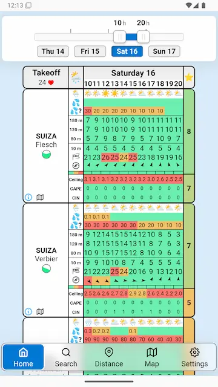
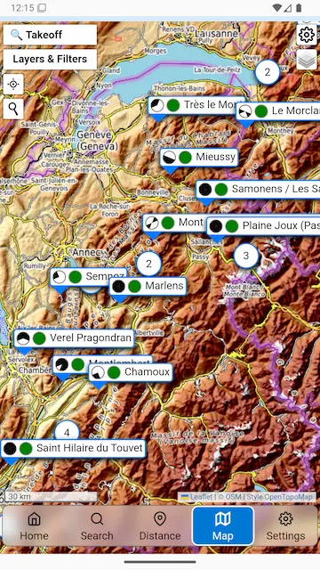
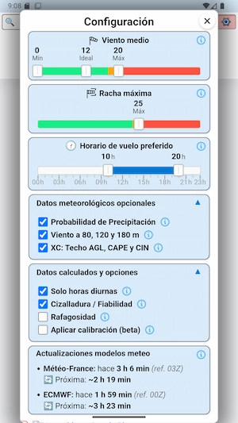
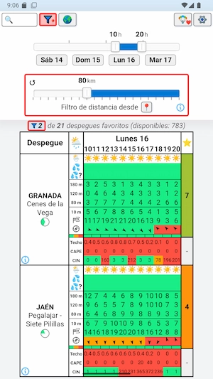
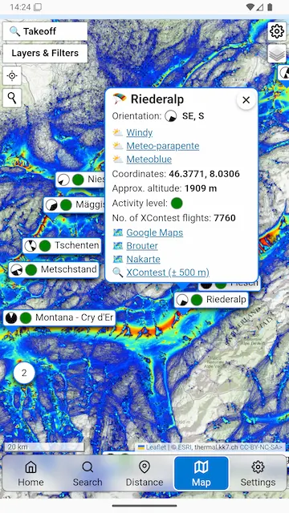
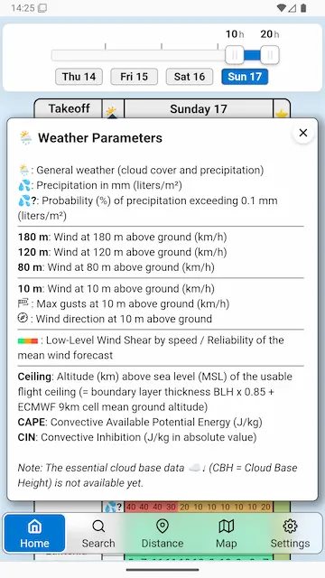
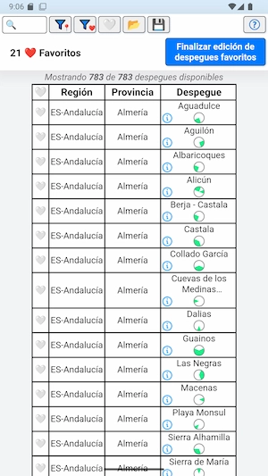
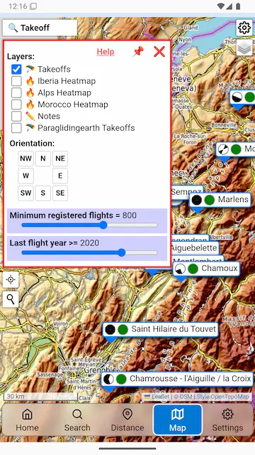
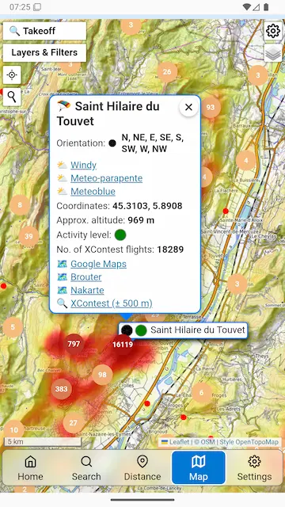

# Fly Decision

A Web / Android mobile / WPA application for automatic weather forecast analysis tailored for paragliding launch sites. Provides visual evaluations using a color-coded system to help paragliders make informed decisions about flying conditions. It has many more features and a launch site map with useful information and various filters (number of flights, average distance, etc.).

> 🌱 **A brief note on our history:**
> Before making its official debut here on GitHub as Free Software on March 2026, this project had already been in active development for **a full year**. While it was built with an open philosophy from the start, this repository marks the first time the codebase is officially published and structured for public access and community collaboration.

## Download Android app

<a href="https://play.google.com/store/apps/details?id=com.flydecision">
  
</a>

## Screenshots

<table align="center">
  <tr>
    <td></td>
    <td></td>
    <td></td>
    <td></td>
    <td></td>
  </tr>
  <tr>
    <td></td>
    <td></td>
    <td></td>
    <td></td>
    <td></td>
  </tr>
</table>

## Features

- **Weather forecast**: 

| Symbol / Metric | Description | Unit |
| :--- | :--- | :--- |
| **🌦️ Weather Icon** | General weather (cloud cover and precipitation) | - |
| **💦 Precipitation** | Amount of precipitation | mm (litres/m²) |
| **💦? Probability** | Probability that precipitation exceeds 0.1 mm | % |
| **180 m** | Mean wind at 180 m above ground | km/h |
| **120 m** | Mean wind at 120 m above ground | km/h |
| **80 m** | Mean wind at 80 m above ground | km/h |
| **10 m** | Mean wind at 10 m above ground | km/h |
| **💨 Max Gust** | Maximum gust at 10 m above ground | km/h |
| **🧭 Wind Dir.** | Wind direction at 10 m above ground | Degrees / Cardinal |
| **⚠️ Wind Shear** | Low-Level Wind Shear by speed / Forecast reliability | - |
| **☁️ MSL Ceiling** | Height of the boundary layer (BLH) referenced to sea level | km |
| **⚡ CAPE** | Convective Available Potential Energy | J/kg |
| **🛑 CIN** | Convective Inhibition | J/kg |

Note: The essential cloud base data ☁↓ (CBH = Cloud Base Height) is not available to complete the launch weather information (requested from the weather gateway in March 2026).

- **Data updates**: Updated automatically (Météo-France 8 times per day and European Centre for Medium-Range Weather Forecasts 4 times per day).
- **Wind Analysis**: Predictions for speed, direction, gusts, and turbulence (raffiness) across multiple altitudes
- **Customizable Thresholds**: Set minimum, ideal, and maximum wind speeds
- **Interactive Map**: Leaflet-based visualization of launch sites
- **External Integrations**: Links to Windy, Meteoblue, and Meteo-Parapente websites
- **Offline Support**: Local storage and caching for offline use
- **PWA**: Installable as a website that looks and behaves like a native mobile app, in computers, Android or iOS

## Technologies

### Frontend
- HTML5/CSS3 with Flexbox
- Vanilla JavaScript
- Leaflet.js for maps
- NoUISlider for range inputs
- Tippy.js for tooltips
- Driver.js for tutorials

### Mobile
- Capacitor v8.x for cross-platform deployment
- Progressive Web App (PWA)
- Capacitor plugins

### Android
- Gradle 8.13.0
- Android build tools

## Installation

### Prerequisites
- Node.js (v14 or higher)
- npm
- Capacitor CLI: `npm install -g @capacitor/cli`
- Android Studio (for Android builds)

### Setup
1. Clone the repository:
   ```bash
   git clone https://github.com/flydecisionj/flydecision.git
   cd flydecision/flydecision
   ```

2. Install dependencies:
   ```bash
   npm install
   ```

3. Sync Capacitor:
   ```bash
   npx cap sync android
   ```

4. Build the web assets:
   ```bash
   # If you have a build script, run it; otherwise, assets are in src/
   ```

5. Open in Android Studio:
   ```bash
   npx cap open android
   ```

## Usage

1. Launch the app on your device.
2. Select your favorites launch sites.
3. Set your wind speed and timetable preferences using the sliders.
4. View forecasts for nearby launch sites on the map.
5. Tap on info button of the sites to see more info and access to launch maps.
6. Check the original values from the weather model.
7. Evaluate the conditions using the visual color cues according to the defined thresholds: 🟩🟨🟥.

## Project Structure

### Core Files
- `src/index.html` - Main HTML entry point
- `src/meteo.js` - Core application logic (~1000 lines)
- `src/meteo.css` - Stylesheet
- `src/manifest.json` - PWA manifest
- `src/ayuda/index.html` - Help
- `src/changelog/index.html` - Changelog
- `src/icons/index.html` - Icons
- `src/map/index.html` - Map
- `src/privacidad/index.html` - Privacy and legal policy

### Configuration
- `capacitor.config.json` - Capacitor settings
- `package.json` - Node dependencies
- `android/` - Android-specific files

### Libraries
- `src/css/` - Styles for Leaflet, NoUISlider, Driver.js
- `src/js/` - JavaScript libraries

## Build Setup

- **Web Assets**: Served from `www/` directory
- **Android**: Built via Gradle wrapper (`gradlew`)

### Development Dependencies
- @capacitor/cli: ^8.0.2
- @capacitor/assets: ^3.0.5
- patch-package: ^8.0.1

### Data Sources
- The wind forecast models used are **AROME-HD 1.3 km** (for the first 0–48 h) and **ARPEGE 7 km** (for the following 48–96 h). Other meteorological variables come from **ECMWF IFS HRES 9 km**.
- 8 (Météo-France) and 4 (ECMWF) daily forecast updates
- The original data come from the public services provided by Météo-France and European Centre for Medium-Range Weather Forecasts, accessed through the gateway provided by Open‑Meteo (https://open-meteo.com/).

### Offline & Storage
- localStorage for settings
- Network status detection
- Data caching

## Contributing

1. Fork the repository
2. Create a feature branch
3. Make your changes
4. Test on Android device/emulator
5. Submit a pull request
6. Submit issues with your proposals for new features, detected bugs, suggested improvements, etc.

## License

[](https://www.gnu.org/licenses/agpl-3.0)

This project is free software and is distributed under the **GNU Affero General Public License v3.0 (AGPL-3.0)**.

In short, this means you are free to use, modify, and distribute this software. However, if you modify the code and make it accessible to others over a network (such as a web application, an API, or a SaaS), **you are required to publish the source code of your modifications** under this same license. This ensures that improvements continue to benefit the community.

For full details, please check the [LICENSE.md](LICENSE.md) file included in the root of this repository.

---

## Links & Resources

* [Help](https://flydecision.com/ayuda/)
* [Changelog](https://flydecision.com/changelog/)
* [Legal Notice and Privacy Policy](https://flydecision.com/privacidad/)

*Fly Decision* - Automatic analysis of the weather forecast for paragliding flights. Launch site map.

---

## 🕊️ Philosophy: Why Free Software?

While the terms are often used interchangeably, there is a fundamental difference between *Open Source* and *Free Software*. This project is licensed under **AGPLv3** because we are deeply aligned with the ethical and social values of the **Free Software movement**: promoting social solidarity, sharing, and cooperation.

For us, keeping software free is an ethical imperative to protect users from abuse and ensure that collective work is never hijacked by large corporations for exclusive profit. 

Here is why we stand by Free Software over purely permissive Open Source models:

* **The Open Source Approach (Pragmatic):** Focuses mainly on technical benefits (making better, more secure software). Permissive licenses (like MIT) essentially say: *"Do whatever you want with this code, even close it and sell it; just put my name in the credits."* This allows big tech companies to take community-built code, integrate it into proprietary products, and profit enormously without giving anything back.
* **The Free Software Approach (Ethical):** Focuses on user freedom and equitable redistribution. Copyleft licenses (like GPL/AGPL) declare: *"You are free to use and modify this code, but you are forbidden from taking that freedom away from others."* **Our Commitment:**
By using the AGPLv3 license, we guarantee that this work will always belong to the people. If anyone—including corporations with vast resources—benefits from this community project and improves it, they cannot privatize the code. They are legally obligated to return their improvements to the community under the same free terms.

> *"For the free software movement, free software is an ethical imperative, essential respect for the users' freedom. By contrast, the philosophy of open source considers issues in terms of how to make software ‘better’—in a practical sense only."*
> — Read more: [Why Open Source misses the point of Free Software](https://www.gnu.org/philosophy/open-source-misses-the-point.html)

---

## 🎯 Intended Use

**Fly Decision** is a decision-support tool designed to provide an automatic analysis of numerical weather forecasts for paragliding launch sites. 

The system evaluates predicted weather parameters (such as rain, wind speed, gusts, and direction) against user-defined safety limits and provides a quick visual overview. 

**Core Mechanics:**
* **Automatic Forecast Analysis:** Processes weather data automatically.
* **Hourly Predictions:** Detailed breakdown of conditions hour by hour.
* **Configurable Safety Thresholds:** Users define their own personal limits based on their skill level and the specific site.
* **Colour-Coded Evaluation:** Each time slot is classified using a simple color scale for rapid assessment.

---

## ⚠️ Disclaimer & Liability

> **CRITICAL SAFETY WARNING**
> 
> This software is provided for **informational purposes only** and must **not** be used as a flight safety system.
> 
> * **Model Limitations:** This software analyzes numerical weather forecasts. These forecasts may contain significant errors or fail to represent actual local conditions and micro-meteorological effects.
> * **Not a Sole Source:** The output generated by this application must never be used as the sole basis for flight safety decisions.
> * **Pilot Responsibility:** The pilot in command is **solely and fully responsible** for evaluating the real, on-site conditions and making the final decision on whether it is safe to fly.

---

## 🤝 Special Acknowledgement: Open-Meteo

This project is powered by the public weather forecast services of Météo-France and ECMWF via **[Open-Meteo](https://open-meteo.com/)**. We want to express our deepest gratitude for their service, their unwavering commitment to the free software community, and for generously granting us a license to access their comprehensive weather data.

**About Open-Meteo:**
Open-Meteo is an open-source weather API that delivers highly accurate and reliable forecasts worldwide. Their platform is an invaluable resource for developers due to its key features:

* **High-Resolution Open Data:** They partner with national weather services to provide data with a resolution ranging from 1 to 11 kilometers.
* **Intelligent Routing:** Their powerful APIs automatically select the most suitable weather models for any specific location, ensuring maximum precision.
* **Seamless Integration:** They offer a highly accessible, user-friendly JSON API that makes retrieving complex weather information effortless.

Thank you, Open-Meteo, for supporting developers and making high-quality weather data accessible to everyone!

> **Note:** This extended acknowledgement is a personal initiative to show our appreciation. Open-Meteo does not require this level of praise; their only official requirement for using their free API is a simple attribution, which is clearly detailed on their [License page](https://open-meteo.com/en/licence).